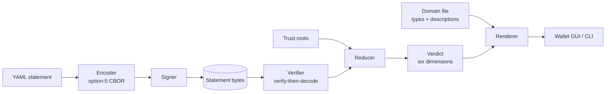

# Product Specification — Key-centric Semantic Attestations

| | |
|---|---|
| **Project** | Key-centric Semantic Attestations (KSA) |
| **Sponsor** | Paul Lambert — personal capacity, no company, no NDA |
| **Team** | David Hsiao · Ndewedo Newbury |
| **Class** | CS690 Fall 2026 — Instructor: Mario Lin |
| **Date** | 2026-09-28 (draft 0.2) |
| **Export as** | `ProductSpec_Fall2026_KSA.pdf` |

> **Working-draft markers.** `▲ GAP-n` = no answer exists yet; decided in the
> weekly meeting, then removed. `(proposed)` = drafted here, needs team
> confirmation. Remove both before export.

---

## 1. Project Overview

### 1.1 Sponsor
- **Primary sponsor:** Paul Lambert, paul@nymbus.net. No one else in a sponsor
  organisation; advisory contact with Prof. Mario Lin.
- **Company:** none. The project is sponsored in a personal capacity; results
  are open source.

### 1.2 Project Motivation (Why)
**System overview.** Digital signatures prove only that *a key was used over
these bytes*. Every system built on them — X.509, PGP, software supply-chain
attestation, content credentials — must separately answer *who holds the key*,
*what that key may say*, and *where trust begins*, and most answer the last two
out of band or not at all (survey R-001 §11). The overall system is a
**key-centric attestation model**: principals are keys, names are local to the
key that defines them (SDSI), authority is delegated and narrowed explicitly
(SPKI), and statements are typed by vocabularies that carry human-readable
meaning (PICS).

**Purpose and core problem.** Mainstream stacks verify *that* a statement was
signed but not *whether the signer had standing to say it*. The May 2026 npm
compromise shipped 84 packages with fully valid provenance naming the correct
builder — every signature checked, and the answer was useless (R-001 §8.6).
The need: a model in which authorization and meaning are part of the statement,
checked by the verifier, and explained to a person.

### 1.3 Project Description (What)
In one semester the project delivers (PLAN-0001 D0–D10):
1. A **specification**: the statement form *A says B has C*, key-relative type
   names, the encoding (DEC-002 option 5), and the reduction algorithm.
2. A **wallet application** that makes statements, holds trust roots, and
   checks a set of statements, explaining the verdict in plain language.
3. **Two worked domains** (D-1): software supply chain, and archives/library —
   statements about the project's own bibliographic library.
4. A **bibliographic library** and three **research reports**, plus a survey
   paper (R-001) already in draft.

### 1.4 Comparative and Competitive Systems
From survey R-001 §11.1, which classifies fourteen systems:

| system | what it does well | what it leaves out |
|---|---|---|
| X.509 / PKIX | ubiquitous; path validation | scoping optional — 1.8% of intermediates carry name constraints |
| OpenPGP web of trust | key-centric | scope is a regex over a display string; no standard evaluator |
| SDSI / SPKI | local names; tag intersection | never shipped a wire format |
| in-toto / SLSA / Sigstore | provenance evidence at scale | "who may sign" is a parameter or a CLI flag |
| SCITT (RFC 9943) | transparent registration policy | policy language not interoperable |
| C2PA | content provenance, regulatory pull | vocabulary fixed in the spec; unknown assertions are opaque |
| Macaroons / Biscuit / UCAN | attenuating capabilities | no naming layer; no closed-form meet |
| TPM / RATS | hardware-rooted state claims | a snapshot, not delegation |

**Our difference:** type names are local to a key (ARCH-0002 P1), a type *is*
a schema with human-readable descriptions (P3), and authorization is reduced,
not assumed.

### 1.5 External Systems
No runtime connections. The project **imports and exports** — in-toto/SLSA
statements (D7), COSE as an export envelope (D-3) — as files. No network,
registry or transparency log is required (ARCH-0001 NG4; APP-0001 §5).

---

## 2. Users

### 2.1 Intended Users
Three user types (proposed):

| type | who | technical? |
|---|---|---|
| **Relying party** | decides whether to believe a claim — a release engineer checking an artifact, a librarian checking a record | technical to semi-technical |
| **Issuer** | makes and signs statements — a build system, a maintainer, a reviewer | technical |
| **Domain author** | defines what statements mean: types, allowed values, descriptions | specialist |

▲ **GAP-1 — personas.** One named persona per type (background, goal,
frustration). **Owner: David + Ndewedo, due Oct 5**, with the schema scenarios.

### 2.2 User Goals
| type | goal |
|---|---|
| Relying party | "Should I trust this artifact / record, and why?" — one verdict, explained |
| Issuer | "Say something about an artifact, within what I am entitled to say" |
| Domain author | "Publish a vocabulary others can use without asking me" |

**Scenarios** (proposed, one per domain; start-to-end):
- *Supply chain.* Paul delegates to David's key the right to assert
  `build-provenance` for the project's release. A CI key signs
  `reproducible` about `dist/app.pyz`. A relying party runs `check`: signature
  valid, **authorization fails** — the CI key was never delegated. Paul adds the
  delegation; the check passes and prints the statement in plain English.
- *Archives / library.* Ndewedo's key asserts `reviewed` about a library record.
  A reader checks it against a trust root naming Ndewedo's key for the
  `library-review` domain; the wallet renders "this record was reviewed by …".
- *Email delegation (schema scenario only, D-1).* Alice may speak for
  `*@foo.com`; she delegates to Bob; Bob attests Carol's address; Dave's check
  reduces the chain — including the three cases that must fail
  (`prototype/statements/demo_email.py`).

### 2.3 Use Environment
- **Interaction:** a desktop GUI (the wallet) and the same operations from a
  command line; everything local and offline.
- **Usability goal:** function over form. The one thing that must be
  unmistakable is the verdict — *signed* versus *entitled to say it* (APP-0001
  §4). Users are proficient enough to handle key files.

---

## 3. Terminology
Full list: `GLOSSARY-0001`. The essentials:

| term | meaning |
|---|---|
| **Principal** | a public key (or its digest); the only identity the model trusts |
| **Local name** | a name meaningful only relative to the key that defined it (SDSI) |
| **Statement** | *A says B has C*, signed by A's key |
| **Domain of discourse** | a published set of types (schemas) a statement draws from |
| **Delegation** | a statement granting another key the right to speak on a topic, possibly narrowed |
| **Reduction** | composing a chain of delegations into one authorization decision (SPKI) |
| **Trust root** | an unsigned local decision: "I trust key K for topic T" |
| **Attestation** | a signed statement about an artifact or state |
| **CBOR / COSE** | binary data format (RFC 8949) / signing envelope (RFC 9052) |
| **SLSA, in-toto** | software supply-chain provenance frameworks |

---

## 4. Project Functionality

### 4.1 Core Features — MVP
The MVP is the **I3 demo floor (Nov 11)** (APP-0001 §6):

| feature | command |
|---|---|
| define a domain: types, allowed values, descriptions | `domain init / add-type` |
| make and sign a statement | `make` |
| delegate the right to speak on a topic | `make --type …:may-speak` |
| render a statement in plain language (EN/ES) | `render` |
| check a statement — six separate verdict lines | `check` |
| reduce a delegation chain and answer a question | `reduce --ask` |

### 4.2 User Stories (proposed)
- As a **relying party**, I want to see whether a signer was *entitled* to make
  a claim, so that a valid signature from the wrong key does not fool me.
- As a **relying party**, I want the verdict in plain language, so that I can
  act without reading the data structure.
- As an **issuer**, I want to delegate a narrow right to another key, so that I
  do not hand over everything I can say.
- As a **domain author**, I want to publish a vocabulary with descriptions, so
  that any wallet can display statements using it without a software update.
- As a **librarian**, I want to attest that a record was reviewed, so that
  readers can tell reviewed records from stubs.

### 4.3 Extended Features
In priority order (PLAN-0001 cut order): graphic UI polish; SLSA/in-toto import
(D7); thresholds (*k*-of-*n*) in reduction; validity windows; a third domain.
Out of scope: revocation, key management, OpenPGP and X.509 import, networked
distribution.

### 4.4 Non-functional Requirements
- **Performance** (proposed): no hard requirement — verification is local and
  offline. Target: a 10-statement chain checks in under one second on a laptop.
- **Security / privacy:** no home-made cryptography; vetted libraries only.
  The verifier checks the signature over the exact bytes *before* decoding
  (R-O-05). Unknown or invalid fields are rejected, not ignored (P5). Keys stay
  on the user's machine. Threat model and `SECURITY.md`: mofn#30.
- **Scalability / reliability:** not a service; no capacity target. Encoding
  must be deterministic so hashes and signatures reproduce exactly.

---

## 5. Technology & Tools

### 5.1 Technical Stack
| question | answer |
|---|---|
| Development environment | macOS / Linux laptops |
| Deployment | a downloadable desktop application from the project site (GitHub Pages) |
| Languages | Python (prototype, reference implementation); TypeScript/HTML for the GUI; Rust for the Tauri shell |
| Code frameworks | a vetted CBOR library; `cryptography` for signatures |
| UI framework | **Tauri** (web frontend, Python sidecar for the library) — *tentative*, confirm by Oct 14 before GUI work starts |
| Database | **None, by design** — files in `~/.mofn` (§6.4) |
| Why this stack | Python because the prototype exists and reduction logic changes weekly; Tauri (tentative) for small signed desktop installers with a modern UI; CBOR because DEC-002 selected option 5 (reduced CBOR, no IANA tags) for byte-exact hashing |

### 5.2 Development Tools
- **Environment:** VS Code or equivalent, with Claude Code for AI-assisted work.
- **Version control:** GitHub, org `m-of-n`; repos `mofn` and `library`
  (submodule); protected `main`, PR-only, DCO sign-off; git worktrees for
  parallel work (`CONTRIBUTING.md`, PROC-0003).
- **Conventions:** documents carry schema-checked front matter
  (`bin/validate-archdoc`); decisions recorded as ADRs; library records only via
  `bin/ingest`.

### 5.3 Testing
- **Test vectors** are the primary strategy: for every statement kind, fixed
  YAML input → exact encoded bytes → exact hash, plus chains that must pass and
  chains that must fail with a named reason.
- **Round-trip tests** across option 5 and the option-2 comparison (D5).
- **Tools:** `pytest`, GitHub Actions CI on every PR.

---

## 6. Design

### 6.1 Design Considerations
Hardest problems (DECISIONS-0001):
1. **Deterministic encoding** — the same statement must always produce the same
   bytes, or signatures and hashes break (DEC-002).
2. **Key-relative type names** — types must be named without a central
   registry (P1) and still be self-describing (P3).
3. **Reduction** — composing delegations so authority only narrows, and
   explaining a failure in words.

These drove the architecture: a separate encoding layer, a separate verifier
that never decodes before verifying, and domains as data rather than code.

### 6.2 Technical Architecture

The project is the whole system; it plugs into existing ecosystems only
through import/export (§1.5).

### 6.3 Project Modules & Interfaces
| module | responsibility | today |
|---|---|---|
| `encoding` | YAML ↔ option-5 CBOR, deterministic | `prototype/statements/rcbor.py` |
| `statement` | build and sign *A says B has C* | `statement.py` |
| `domain` | types, value ranges, descriptions, domain hash | `labeltype.py` |
| `reduce` | name resolution + delegation reduction | `reduce.py` |
| `verifier` | six-dimension check | partial |
| `render` | plain-language output, multilingual | partial |
| `wallet` | GUI + CLI over the above | not started |
| `interchange` | in-toto/SLSA import, COSE export | not started (D7) |

**External APIs:** none at runtime. **Other systems relied on:** GitHub for
hosting and Pages. **API developed:** a Python library API matching the CLI
commands in §4.1; no network API.

### 6.4 Data
- **Key groups:** keys; trust roots; statements; domains; the bibliographic
  library (records about references).
- **Flow:** the §6.2 diagram — YAML → encode → sign → bytes → verify → reduce →
  verdict → render.
- **Database:** **none, by design.** Verification is offline over the set of
  statements it is handed, so every result is reproducible from files and no
  server is needed (APP-0001 §5, ARCH-0001 NG4). The wallet keeps its state in
  a plain directory:

  ```
  ~/.mofn/
    keys/         private and public keys (files; no key agent)
    roots/        trust roots — unsigned local decisions
    statements/   statements made or collected, as signed bytes
    domains/      domain files: types, allowed values, descriptions
  ```

  The bibliographic library is a separate git repository of YAML records, not
  a database.

### 6.5 User Interface
- **Mechanism:** desktop GUI and CLI, same operations; the relying party mostly
  uses the GUI, issuers and domain authors mostly the CLI.
- **Sketches** — draft wireframes; *Ndewedo replaces with real sketches by
  Oct 14.*

**① Verdict** — the product screen. The authorization line is the point.
```
┌─ Check statement ───────────────────────────── prov.stmt ─┐
│  "The artifact sha256:8e1c… was built reproducibly         │
│   from published sources."                                 │
│   — asserted by key 9f2a…  (CI build key)                  │
│                                                            │
│  ✔ Integrity      subject digest re-derives                │
│  ✔ Authenticity   signature valid under 9f2a…              │
│  ✔ Names          no name chain to resolve                 │
│  ✘ AUTHORIZATION  9f2a… is not entitled to assert          │
│                   build-provenance about this subject      │
│  – Acceptance     not evaluated                            │
│  ✔ Semantics      domain supply-chain, value in range      │
│                                                            │
│  Signed, but NOT by a key with standing to say it.         │
│  This proves origin and integrity. It does not prove truth.│
│  [ Show chain ]   [ Why? ]   [ Language: EN ▾ ]            │
└────────────────────────────────────────────────────────────┘
```

**② Make a statement** — the form is generated from the domain's type, never
hard-coded.
```
┌─ New statement ────────────────────────────────────────────┐
│  Speak as     [ paul.key ▾ ]                               │
│  About        ( ) artifact [ dist/app.pyz      ] [Browse]  │
│               ( ) key      [                   ]           │
│  Domain       [ supply-chain ▾ ]  Type [ build-provenance ▾]│
│  Claim        (•) reproducible  built reproducibly from …  │
│               ( ) attested      built by an attested …     │
│               ( ) unverified    origin not verified        │
│  Valid until  [ 2026-12-31 ]                               │
│  Preview: "Paul says dist/app.pyz was built reproducibly…" │
│                                     [ Cancel ] [ Sign ]    │
└────────────────────────────────────────────────────────────┘
```

**③ Delegation** — who may speak for me, on what, and whether they may pass
it on.
```
┌─ Delegations ──────────────────────────────────────────────┐
│  Trust roots (mine, unsigned)                              │
│    Paul  →  supply-chain / *            may delegate ✔     │
│    Paul  →  library-review / *          may delegate ✘     │
│  Chain for: "may CI key attest build-provenance?"          │
│    Paul ──▶ David (build-provenance, delegate ✔)           │
│         ──▶ CI key (build-provenance)   ✘ link missing     │
│  [ + Delegate… ]   [ Revoke locally ]   [ Explain ]        │
└────────────────────────────────────────────────────────────┘
```

**④ Domain browser** — the PICS-like layer: what statements in a domain can
mean.
```
┌─ Domains ──────────────────────────────────────────────────┐
│  supply-chain      id 2104d6d4…   defined by paul.key      │
│    build-provenance  reproducible · attested · unverified  │
│    reviewed-by       <key>                                 │
│  library-review    id 7c11e0a2…   defined by ndewedo.key   │
│    reviewed          yes · partial · no                    │
│  Selected: build-provenance / reproducible                 │
│    EN  built reproducibly from published sources           │
│    ES  compilado de forma reproducible desde fuentes …     │
│  [ Import domain… ]  [ New type… ]                         │
└────────────────────────────────────────────────────────────┘
```

---

## 7. Project Organization

### 7.1 Project Tools
| | |
|---|---|
| Methodology | iterative: two-week increments I0–I5, each ending in a demo (PLAN-0003) |
| Sponsor communication | weekly Zoom (Mon 16:00 PT); GitHub PR reviews; email |
| Team communication | GitHub issues and PRs; email; SMS for urgent |
| Task tracking | GitHub issues with assignees; `BACKLOG-0001` |
| Collaboration / documents | the `mofn` repo, published to GitHub Pages; the `library` repo |
| Other | Claude Code for AI-assisted research, drafting and review |

### 7.2 Team Member Roles
| member | role |
|---|---|
| **David Hsiao** | encoding and fixtures (D4, D5), reduction (D6), mappings (D7) |
| **Ndewedo Newbury** | library and method (D1, D2), archives domain, site, wallet GUI (D8) |
| **Both** | research reports (D3), schema scenarios, final report and demo |

### 7.3 Sponsor Meetings
Weekly, 30 minutes, Mondays 16:00 PT, for decisions and unblocking. Notes are
committed the same day under `project/meetings/`. Architecture is reviewed
asynchronously through pull requests.

---

## 8. Goals and Milestones

### 8.1 Project Goals
- **Success:** at CS Night (Dec 4) a relying party sees a supply-chain
  statement and a library statement checked, a delegation chain reduced, a
  broken link named, and the result explained in English — using a published
  specification the audience can read.
- **Metrics** (all checkable on Dec 4):

  | # | metric | target |
  |---|---|---|
  | M1 | Demo cases pass live, including must-fail cases named correctly | all scripted cases; ≥3 failures each explained in English |
  | M2 | Test vectors: YAML → exact bytes → exact hash, every statement kind | 100% pass in CI |
  | M3 | Independent reproduction: second student's encoder matches the first's bytes | 100% of vectors |
  | M4 | Domains render with no type-specific code | 2 domains, EN and ES |
  | M5 | Real SLSA/in-toto attestations import and round-trip | ≥5 public examples |
  | M6 | Wallet installs from Pages | macOS + Linux |
  | M7 | Every survey and report citation resolves to a library record | 100% (CI gate) |
- **Risks and constraints:** encoding ADR slips past Oct 28; the GUI consumes
  I4–I5; ARCH-0002 P4/P7 still open in November; every merge waits on sponsor
  review (PLAN-0003 §Risks).

### 8.2 Project Milestones
| date | milestone |
|---|---|
| ▲ **GAP-6** | second status review · midterm presentation — *dates from Prof. Lin* |
| Oct 5 | schema scenarios |
| Oct 14 | **I1** — library v1, research reports (D1–D3) |
| Oct 21 | encoding-neutral schema (D4) |
| Oct 28 | **I2** — encoding fixtures + ADR (D5) |
| **Nov 11** | **I3 — MVP / demo floor** (D6) |
| Nov 25 | **I4** — SLSA/in-toto mappings (D7) |
| Dec 1 | wallet app published; market research (D8, D9) |
| **Dec 4** | **CS Night — final demo and report (D10)** |

### 8.3 Timeline
See PLAN-0003 §Schedule — five increments, each ending in a demo, with I3 as
the floor that stands on its own if later work slips.
